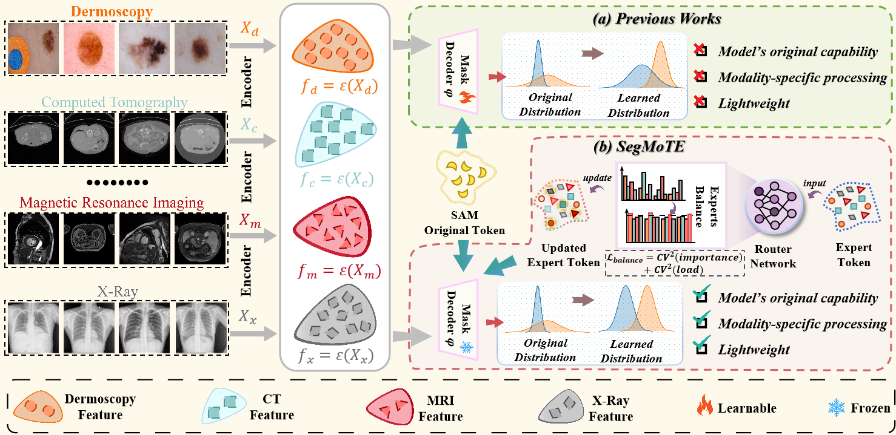
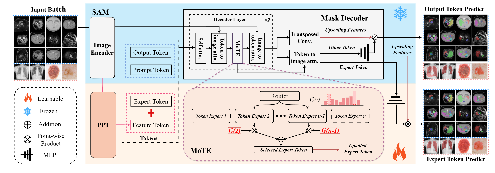

<div align="center">

# SegMoTE: Token-Level Mixture of Experts for Medical Image Segmentation

**Yujie Lu<sup>1*</sup>, Jingwen Li<sup>2*</sup>, Sibo Ju<sup>3</sup>, Yanzhou Su<sup>4</sup>, He Yao<sup>1</sup>, Yisong Liu<sup>1</sup>, Min Zhu<sup>1&dagger;</sup>, Junlong Cheng<sup>1&dagger;</sup>

<sup>1</sup>Sichuan University &nbsp;&nbsp;
<sup>2</sup>Xinjiang University &nbsp;&nbsp;
<sup>3</sup>Fuzhou University &nbsp;&nbsp;
<sup>4</sup>Alibaba DAMO Academy


**CVPR 2026 (Oral)**


[](https://arxiv.org/abs/2602.19213)
[](#installation)
[](#checkpoint)
[](https://huggingface.co/yujielu/SegMoTE/tree/main)


</div>

## Abstract

Medical image segmentation requires robust adaptation across heterogeneous
modalities and anatomical structures, while pixel-level annotation remains
expensive. SegMoTE is an efficient adaptation framework built on the Segment
Anything Model (SAM). It introduces a **token-level Mixture of Experts
(MoTE)** mechanism that dynamically selects modality-adaptive expert tokens,
and a **Progressive Prompt Tokenization (PPT)** module that learns
feature-conditioned prompts for prompt-free segmentation on suitable
foreground-background tasks. Trained on the curated **MedSeg-HQ** dataset,
SegMoTE aims to retain the flexible prompt interface and generalization ability
of SAM while providing lightweight adaptation for multimodal medical image
segmentation.

<p align="center">
  
</p>

## Architecture

<p align="center">
  
</p>

SegMoTE extends SAM with two components. First, **MoTE** injects learnable
expert tokens into the mask decoder and uses token-level routing to select
specialized experts for different modalities and tasks. A load-balancing
objective encourages effective expert utilization. Second, **PPT** pools image
features into adaptive prompt tokens for selected few-class segmentation
settings, reducing dependence on manual prompts. The framework supports point,
bounding-box, and text prompts while retaining an efficient inference path.

## Highlights

- **Token-level expert routing:** SegMoTE activates expert tokens
  for modality- and task-adaptive segmentation.
- **Progressive prompt tokenization:** Feature-conditioned prompt tokens
  support automatic segmentation for suitable binary foreground-background
  tasks.
- **Multimodal medical segmentation:** The framework is designed for medical
  datasets spanning CT, MRI, dermoscopy, X-ray, and other modalities.
- **SAM-compatible interaction:** Point, bounding-box, and text prompts are
  supported in the released implementation.

## Updates

- **May 2026:** Code release preparation and inference checkpoint packaging.
- **May 2026:** Deterministic MoTE routing enabled during evaluation.

## Installation

Create an environment with a CUDA-enabled PyTorch installation appropriate for
your hardware, then install the remaining dependencies:

```bash
git clone <repository-url>
cd SegMoTE
pip install -r requirements.txt
```

The implementation uses PyTorch, TIMM, Transformers, MONAI, OpenCV, and common
scientific Python packages.


## Checkpoint

Two checkpoint files are required for evaluation:

```text
checkpoints/sam_b.pth
checkpoints/segmote.pth
```

| Checkpoint | Usage |
| --- | --- |
| `sam_b.pth` | Base initialization checkpoint loaded with `--sam_checkpoint` before loading SegMoTE weights. |
| `segmote.pth` | SegMoTE inference checkpoint loaded with `--pretrain_path`. |

Download the checkpoints from Baidu Netdisk:

```text
sam_b: https://pan.baidu.com/s/1HcmqPiwpWgnYr4CMf6Y9Pg  Password：eank
segmote: https://pan.baidu.com/s/1tzlOv3YSU-9s6Gaw4pCF6g  Password：wja3
```

Download the checkpoints from Huggingface:

```text
https://huggingface.co/yujielu/SegMoTE/tree/main
```

After downloading, place both checkpoint files in the `checkpoints/`
directory. 

## Evaluation

Evaluate the released checkpoint on a dataset with bounding-box prompts:

```bash
python test.py \
  --data_dir dataset \
  --dataset_list BTCV \
  --sam_checkpoint checkpoints/sam_b.pth \
  --pretrain_path checkpoints/segmote.pth \
  --prompt_mode bboxes \
  --output_dir outputs/BTCV
```

## Training

Train SegMoTE from the base initialization checkpoint:

```bash
python train.py \
  --data_dir dataset \
  --dataset_list BTCV \
  --sam_checkpoint checkpoints/sam_b.pth \
  --task_name segmote_train
```

For distributed training on multiple GPUs:

```bash
python train.py \
  --data_dir dataset \
  --dataset_list BTCV \
  --sam_checkpoint checkpoints/sam_b.pth \
  --task_name segmote_train \
  --dist \
  --multi_gpu \
  --gpu_ids 0 1 2 3 4 5 6 7
```


## Citation

The BibTeX entry will be updated after the public paper record is available:

```bibtex
@article{lu2026segmote,
  title={SegMoTE: Token-Level Mixture of Experts for Medical Image Segmentation},
  author={Lu, Yujie and Li, Jingwen and Ju, Sibo and Su, Yanzhou and Liu, Yisong and Zhu, Min and Cheng, Junlong and others},
  journal={arXiv preprint arXiv:2602.19213},
  year={2026}
}
```

